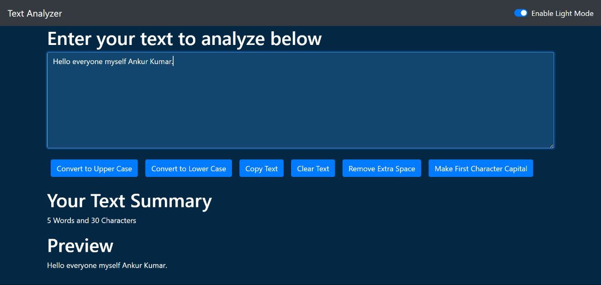

# Text Manipulation Tool

 <!-- Replace with an actual screenshot of your project -->

A simple React.js application that allows users to perform various text manipulation tasks on input text.

## Features

- **Capital All:** Convert all characters in the input text to uppercase.
- **Small All:** Convert all characters in the input text to lowercase.
- **Capital 1st Character of Each Word:** Capitalize the first character of each word in the input text.
- **Remove Blank Spaces:** Remove all blank spaces from the input text.
- **Copy Text:** Copy the manipulated text to the clipboard.
- **Clear All:** Clear the input text area and reset the manipulated text.
- **Word and Character Count:** Display the word and character count of the input text.
- **Light and Dark Mode:** Toggle between light and dark mode for a comfortable viewing experience.

## Getting Started

1. Clone this repository to your local machine.
2. Navigate to the project directory using the terminal.
3. Run `npm install` to install the project dependencies.
4. Run `npm start` to start the development server.
5. Open your web browser and go to `http://localhost:3000` to use the application.

## Usage

1. Enter or paste the text you want to manipulate into the input text area.
2. Click on the respective buttons to perform the desired manipulations.
3. The manipulated text will be displayed below the buttons.
4. The word and character count will be shown below the manipulated text.

## Technologies Used

- React.js
- JavaScript
- CSS (for styling)

## Contributing

Contributions are welcome! If you'd like to contribute to this project, please follow these steps:

1. Fork the repository.
2. Create a new branch for your feature/bugfix.
3. Make your changes and test thoroughly.
4. Create a pull request explaining your changes.

## License

This project is licensed under the [MIT License](LICENSE).

---

Feel free to customize this README to include any additional information specific to your project. Good luck with your project, and happy coding!
